## vSphere Preparation

For static IP configurations, you will need to upload the ISO into a datastore. On the vSphere WebUI, click on the "Storage" navigation button (it looks like stacked cylinders), and click on the datastore you'd like to upload the ISO to. In my example, I have a datastore specifically for ISOs:

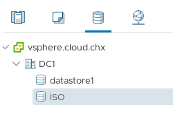

On the right hand side window, you'll see the summary page with navigation buttons. Select "Upload Files" and select the RHCOS ISO.

NOTE: Make sure you upload the ISO to a datastore that all your ESXi hosts have access to.

Once uploaded, you should have something like this:

You will also need the aforementioned OpenShift 4 Metal BIOS file. I've downloaded the bios file and saved it as bios.raw.gz on my webserver.

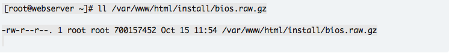

#### CREATING THE VIRTUAL MACHINES

You create the RHCOS VMs for OpenShift 4 the same way you do any other VM. I will go over the process of creating the bootstrap VM. The process is similar for the masters and workers.

On the VMs and Template navigation screen (the one that looks like sheets of paper); right click your **cluster-id folder** and select New Virtual Machine.

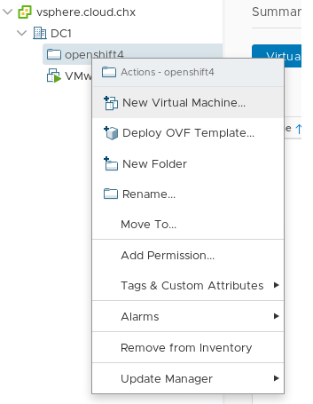

The "New Virtual Machine" wizard will start.

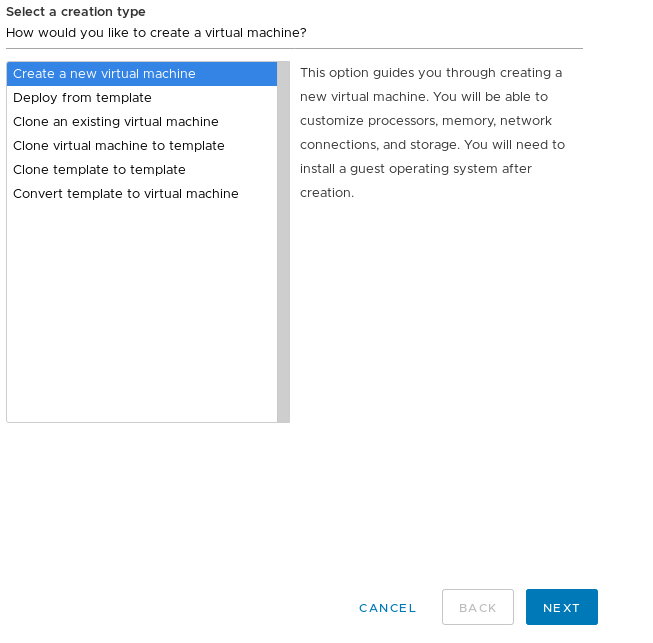

Make sure "Create a new virtual machine" is selected and click next. On the next screen, name this VM "bootstrap" and make sure it gets created in the openshift4 folder. It should look like this:

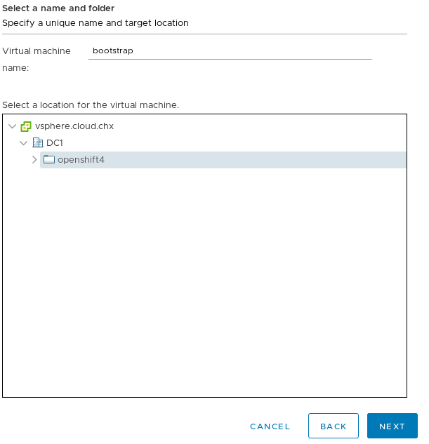

On the next screen, choose an ESXi host in your cluster for the initial creation of this bootstrap VM, and click "Next". The next screen it will ask you which datastore to use for the installation. Choose the datastore appropriate for your installation.

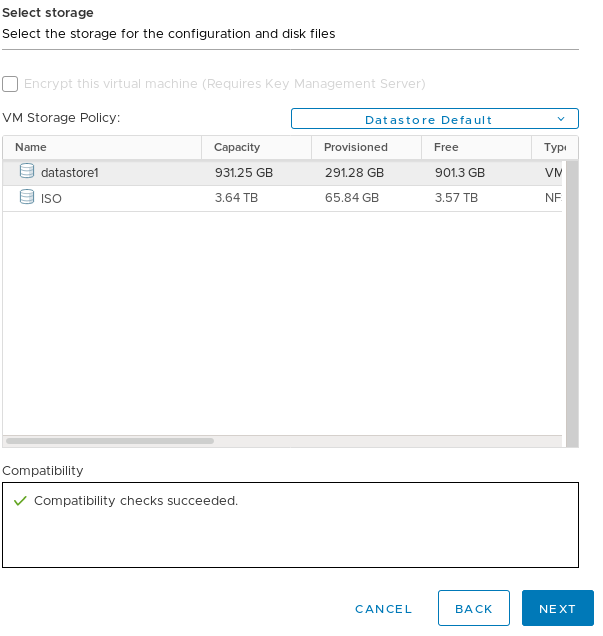

On the next page, it'll ask you to set the compatibility version. Go ahead and select "ESXi 6.7 and Later" for the version and select next. On the next page, set the OS Family to "Linux" and the Version to "Red Hat Enterprise Linux 7 (64-Bit).

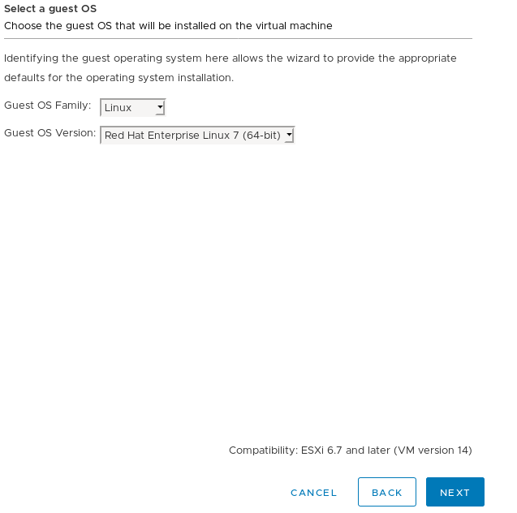

After you click next, it will ask you to customize the hardware. For the bootstrap set 4vCPUs, 8 GB of RAM, and a 120GB Hard Drive.

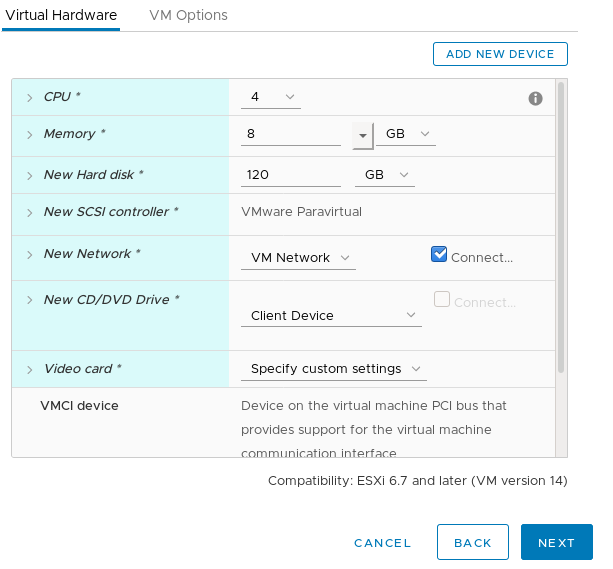

On The "New CD/DVD Drive" select "Datastore ISO File" and select the RHCOS ISO file you've uploaded earlier.

Next, click on the "VM Options" tab and scroll down and expand "Advanced". Set "Latency Sensitivity" to "High".

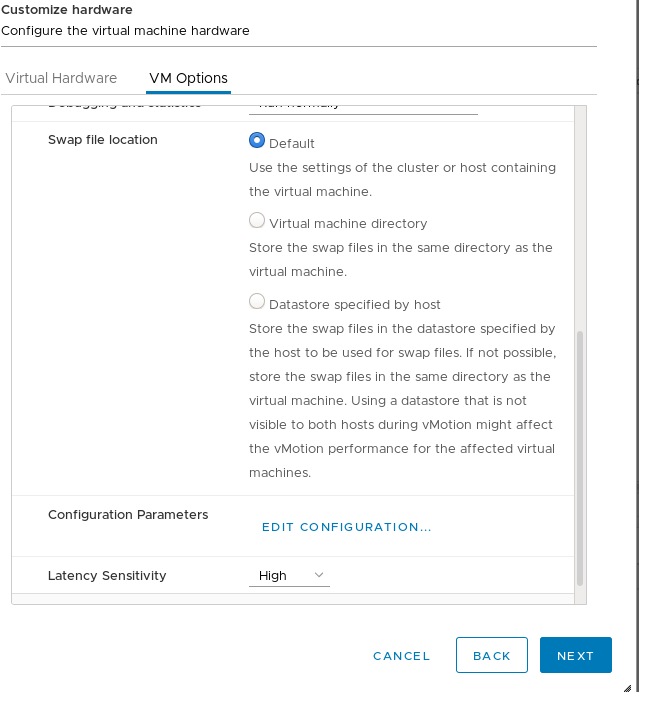

Click "Next". This will bring you to the overview page:

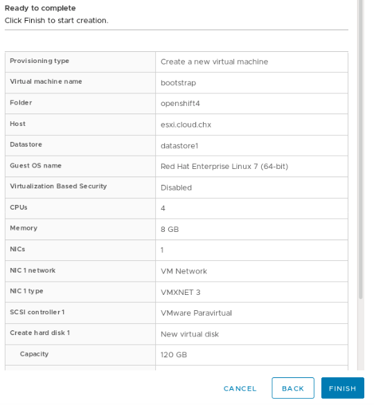

Go ahead and click "Finish", to create this VM.

You will need to run through these steps at least 5 more times (3 masters and 2 workers). Use the table below (based on the official documentation) to create your other 5 VMs.

[table id=2 /]

NOTE, if you're cloning from the bootstrap, make sure you adjust the parameters accordingly and that you're selecting "thin provision" for the disk clone.

Once you have all the servers created, the openshift4 directory should look something like this:

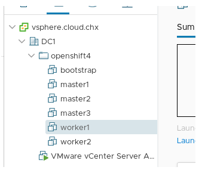

Next, boot up your bootstrap VM and open up the console. You'll get the "RHEL CoreOS Installer" install splash screen. Hit the TAB button to interrupt the boot countdown so you can pass kernel parameters for the install.

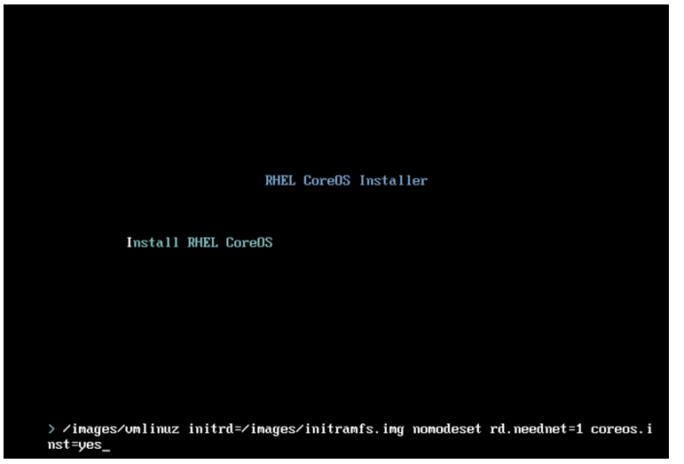

On this screen, you'll pass the following parameters. Please note that this needs to be done all on one line, I broke it up for easier readability.

---
ip=192.168.1.116::192.168.1.1:255.255.255.0:bootstrap.openshift4.example.com:ens192:none

nameserver=192.168.1.2

coreos.inst.install_dev=sda

coreos.inst.image_url=http://192.168.1.110:8080/install/bios.raw.gz

coreos.inst.ignition_url=http://192.168.1.110:8080/ignition/append-bootstrap.ign
---

NOTE Using ip=... syntax will set the host with a static IP you provided persistently across reboots. 
The syntax is: ip=$IPADDRESS::$DEFAULTGW:$NETMASK:$HOSTNAMEFQDN:$IFACE:none nameserver=$DNSSERVERIP

This is how it looked like in my environment:

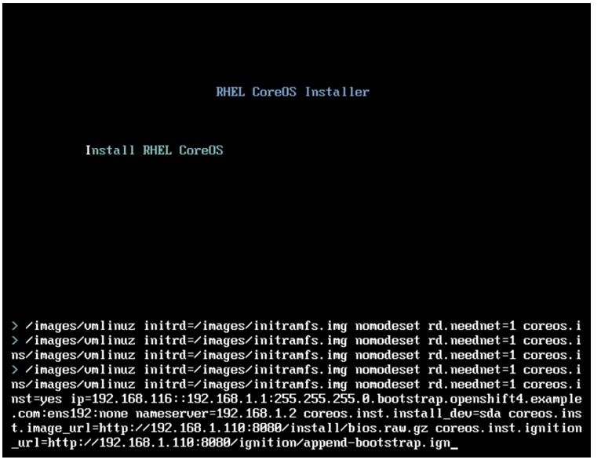

Do this for ALL your servers, substituting the correct ip/config where appropriate. I did mine in the following order:

Bootstrap
Masters
Workers