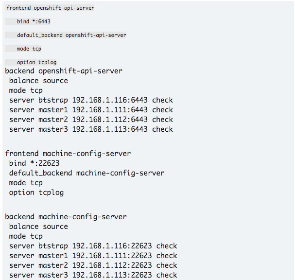

# OpenShift 4.2+ vSphere Install with Static IPs

 In this link::https://red.ht/3bg13ok[previous blog] show for us how to install OpenShift 4.2+ on VMware vSphere 6.7 using DHCP. Using DHCP with address reservation via MAC address filtering is a common way of ensuring network configurations are set and consistent on Red Hat Enterprise Linux CoreOS (RHCOS).

Many environments would rather use static IP configuration to achieve the same consistent network configurations. With the release of OpenShift 4.2, we have now added the ability to configure network configurations (and persist them across reboots) in the preboot ignition phase for RHCOS.

In this blog we are going to go over how to install OpenShift 4.2+ on VMware vSphere using static IPs.

## Environment Overview

As in the link::https://red.ht/3bg13ok[previous blog], We will be using vSphere version 6.7.0 and ESXi version 6.7.0 Update 3. We will be following the link:https://docs.openshift.com[OpenShift Documentation] where, you can read more information about prerequisites including the need to set up DNS, Load Balancer, Artifacts, and other ancillary services/items.

## Prerequisites
It's always important that you get familiar with the prerequisites by reading the link:https://docs.openshift.com[OpenShift Documentation] before you install. There you can find more details about the prerequisites and what they entail. I will go over the prerequisites at a high level, and will link examples where possible.

#### VSPHERE CREDENTIALS
We will be using my administrative credentials for vSphere. We will also be passing these credentials to the OpenShift 4 installer and, by extension, to the OpenShift cluster. It's not a requirement to do so, and installing without the credentials will effectively turn your installation into a link::https://red.ht/2WwuCMR[Bare Metal UPI] installation. Most notably, you'll lose the ability to dynamically create VDMKs for your applications at install time.

#### DNS

Like any OpenShift 4 installation, the first consideration you need to take into account when setting up DNS for OpenShift 4 is the **"cluster id"**. The "cluster id" becomes part of your cluster's FQDN. For example; with a cluster id of **"ocp"** and my domain of "example.com", the cluster domain (i.e. the FQDN) for my cluster is **ocp.example.com**

DNS entries are created using the **$CLUSTERID.$DOMAIN** cluster domain FQDN nomenclature. All DNS lookups will be based on this cluster domain. Using my example cluster domain, **ocp.example.com**, I have the following DNS entries set up in my environment. Note that the etcd servers are pointed to the IP of the masters, and they are in the form of **etcd-$INDEX**.

image::images/dnstest01.png[DNS Tests]

The DNS lookup for the API endpoints also needs to be in place. OpenShift 4 expects **api.$CLUSTERDOMAIN** and **api-int.$CLUSTERDOMAIN** to be configured, they can both be set to the same IP address - which will be the IP of the Load Balancer.

image::images/dnstest02.png[APIs DNS Tests]

A wildcard DNS entry needs to be in place for the OpenShift 4 ingress router, which is also a load balanced endpoint.

image::images/dnstest03.png[Wildcard DNS Test]

In addition to the mentioned entries, you'll also need to add SRV records. These records are needed for the masters to find the etcd servers. This needs to be in the form of **_etcd-server-ssl._tcp.$CLUSTERDOMMAIN** in your DNS server.

image::images/dnstest03.png[SRV DNS Test]

Please review the link::https://docs.openshift.com[OpenShift Documentation] to read more about the prerequisites for DNS before installing.

## LOAD BALANCER

You will need a load balancer to frontend the APIs, both internal and external, and the OpenShift router. Although Red Hat has no official recommendation to which load balancer to use, one that supports SNI is necessary (most load balancers do this today).

You will need to configure port **6443** and **22623** to point to the bootstrap and master nodes. The below example is using HAProxy (NOTE that it must be TCP sockets to allow SSL passthrough):

You will also need to configure **80** and **443** to point to the worker nodes. The HAProxy configuration is below (keeping in mind that we're using TCP sockets).

image::images/lbinfranodes.png[APIs LoadBalancer]

More information about load balancer configuration (and general networking guidelines) can be found in the official link:https://docs.openshift.com[OpenShift Documentation].

## ARTIFACTS

You will need to obtain the installation artifacts by visiting try.openshift.com, there you can login and click on "VMware vSphere" to get the installation artifacts. You will need:

link::https://red.ht/3djUouw[OpenShift4 Client Tools]
link::https://red.ht/2SGYTHK[OpenShift4 OVA]
Pull Secret
You will also need the link::https://red.ht/2zhkcbQ[RHCOS ISO] and the link::https://red.ht/2SFw0vF[OpenShift4 Metal BIOS file]
