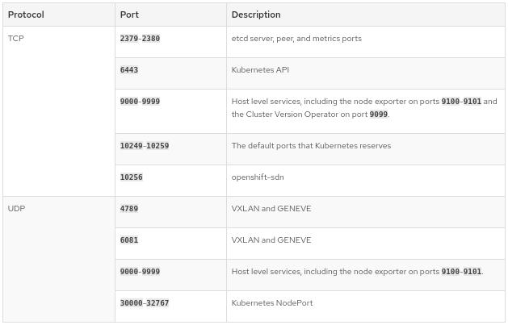

# Deploy OCP on vSphere

### Prerequisites Preparation

The following services are pre-requisites for OpenShift 4.3 installation on vSphere (https://docs.openshift.com/container-platform/4.3/installing/installing_vsphere/installing-vsphere.html[see more on the official docs for OpenShift]) :

- RESOURCES
- NETWORK
- DNS
- DHCP
- Load Balancer
- vSphere 6.7U2

### Minimum resource requirements

image::images/servers-resources.png[Servers Resources]

### Networking requirements for user-provisioned infrastructure

**All machines to all machines**

### NETWORK TOPOLOGY REQUIREMENTS
The infrastructure that you provision for your cluster must meet the following network topology requirements.

[NOTE]
===
OpenShift Container Platform requires all nodes to have internet access to pull images for platform containers and provide telemetry data to Red Hat.
===

**Load balancers** 
Before you install OpenShift Container Platform, you must provision two layer-4 load balancers. The API requires one load balancer and the default Ingress Controller needs the second load balancer to provide ingress to applications.

image::images/networking01.png[Network Resources]

### ETHERNET ADAPTOR HARDWARE ADDRESS REQUIREMENTS
When provisioning VMs for the cluster, the ethernet interfaces configured for each VM must use a MAC address from the VMware Organizationally Unique Identifier (OUI) allocation ranges:

00:05:69:00:00:00 to 00:05:69:FF:FF:FF

00:0c:29:00:00:00 to 00:0c:29:FF:FF:FF

00:1c:14:00:00:00 to 00:1c:14:FF:FF:FF

00:50:56:00:00:00 to 00:50:56:FF:FF:FF

If a MAC address outside the VMware OUI is used, the cluster installation will not succeed.

### Required DNS records

##### Set your DNS spreedsheet

link:https://github.com/jonascavalcantineto/ocp-bootstrap-ignition/blob/release-v4.3-vsphere6.7U2/documentation/spreedsheets/ocp-dns-registries.xlsx[get the XLSX]

[cols="5,2,3",options=header]
|===
|Component	
|Record	
|Description

|Kubernetes API
|api.<cluster_name>.<base_domain>
|This DNS record must point to the load balancer for the control plane machines. This record must be resolvable by both clients external to the cluster and from all the nodes within the cluster.

|Kubernetes API
|api-int.<cluster_name>.<base_domain>
|This DNS record must point to the load balancer for the control plane machines. This record must be resolvable from all the nodes within the cluster.The API server must be able to resolve the worker nodes by the host names that are recorded in Kubernetes. If it cannot resolve the node names, proxied API calls can fail, and you cannot retrieve logs from Pods.

|Routes
|*.apps.<cluster_name>.<base_domain>
|A wildcard DNS record that points to the load balancer that targets the machines that run the Ingress router pods, which are the worker nodes by default. This record must be resolvable by both clients external to the cluster and from all the nodes within the cluster.

|etcd
|etcd-<index>.<cluster_name>.<base_domain>
|OpenShift Container Platform requires DNS records for each etcd instance to point to the control plane machines that host the instances. The etcd instances are differentiated by <index> values, which start with 0 and end with n-1, where n is the number of control plane machines in the cluster. The DNS record must resolve to an unicast IPv4 address for the control plane machine, and the records must be resolvable from all the nodes in the cluster.

|etcd
|_etcd-server-ssl._tcp.<cluster_name>.<base_domain>
|For each control plane machine, OpenShift Container Platform also requires a SRV DNS record for etcd server on that machine with priority 0, weight 10 and port 2380. A cluster that uses three control plane machines requires the following records:
|===

[cols="3,2,2,2,2,2,2,8",options=header]
|===
|# _service._proto.name.                            
|TTL    
|class 
|SRV 
|priority 
|weight 
|port 
|target

|_etcd-server-ssl._tcp.<cluster_name>.<base_domain>  
|86400 
|IN    
|SRV 
|0        
|10     
|2380 
|etcd-0.<cluster_name>.<base_domain>.

|_etcd-server-ssl._tcp.<cluster_name>.<base_domain>  
|86400 
|IN    
|SRV 
|0        
|10     
|2380 
|etcd-1.<cluster_name>.<base_domain>.

|_etcd-server-ssl._tcp.<cluster_name>.<base_domain>  
|86400 
|IN    
|SRV 
|0        
|10     
|2380 etcd-2.<cluster_name>.<base_domain>.
|===

*_DNS Settings:_ Example*
----
[user0@infra-services ~]# sudo cat /var/named/ocp.rhbr-labs.com.zone 
$TTL 3600	; 1 hour
@	IN SOA	ocp.rhbr-labs.com. netmaster.ocp.rhbr-labs.com. (
				2020030501 ; serial
				86400      ; refresh (1 day)
				3600       ; retry (1 hour)
				86400      ; expire (1 day)
				3600       ; minimum (1 hour)
				)
@			IN 	NS	ns1

;Proxy LoadBalancers
ns1			IN A		10.11.2.3
bastion1	IN A		10.11.2.3
lb			IN A		10.11.2.3

;Control Plannel (Masters Servers)
master-0		IN A	10.11.2.2
etcd-0		IN A		10.11.2.2

;Workers
worker1		IN A		10.11.2.4
worker2		IN A		10.11.2.5
worker3		IN A		10.11.2.6
worker4		IN A		10.11.2.7

;OCP|Kubernestes API  and APPS
api			CNAME		lb
api-int		CNAME		lb
*.apps		CNAME		lb

; ETCDs services 
_etcd-server-ssl._tcp	IN SRV	0	10	2380	etcd-0

[user0@infra-services ~]# sudo cat /var/named/2.11.10.in-addr.arpa
$ORIGIN .
$TTL 3600	; 1 hour
2.11.10.in-addr.arpa	IN SOA	ns1.ocp.rhbr-labs.com. netmaster.ocp.rhbr-labs.com. (
				2020030501 ; serial
				86400      ; refresh (1 day)
				3600       ; retry (1 hour)
				86400      ; expire (1 day)
				3600       ; minimum (1 hour)
				)
			NS	ns1.ocp.rhbr-labs.com.

$ORIGIN 2.11.10.in-addr.arpa.

2		PTR	master1.ocp.rhbr-labs.com.
4		PTR	worker1.ocp.rhbr-labs.com.
5		PTR	worker2.ocp.rhbr-labs.com.
6		PTR	worker3.ocp.rhbr-labs.com.
7		PTR	worker4.ocp.rhbr-labs.com.

----

### If your network has *_DHCP:_*, following a example bellow. Otherwise if you need set on nodes static ip you need to follow this documentation 

----
[user0@infra-services ~]# sudo cat /etc/dhcp/dhcpd.conf
default-lease-time 900;
max-lease-time 7200;
subnet 10.11.2.0 netmask 255.255.0.0 {
	option routers 10.11.2.2;
	option subnet-mask 255.255.0.0;
	option domain-name-servers 10.11.2.5;
	next-server 10.11.2.5;
}

#### CLUSTER OCP
host bootstrap-0 {
    hardware ethernet 00:50:56:01:00:01;
    fixed-address 10.11.2.2;
    option host-name "bootstrap-0.ocp.rhbr-labs.com";
}
host master-0 {
    hardware ethernet 00:50:56:01:00:02;
    fixed-address 10.11.2.101;
    option host-name "master-0.ocp.rhbr-labs.com";
}
(...)
----

*_HAProxy Load Balancer:_*

----
[root@infra-services ~]# sudo cat /etc/haproxy/haproxy.cfg
global
log 127.0.0.1 local2
chroot /var/lib/haproxy
pidfile /var/run/haproxy.pid
maxconn 4000
user haproxy
group haproxy
daemon
stats socket /var/lib/haproxy/stats
ssl-default-bind-ciphers PROFILE=SYSTEM
ssl-default-server-ciphers PROFILE=SYSTEM

defaults
mode http
log global
option httplog
option dontlognull
option http-server-close
option forwardfor except 127.0.0.0/8
option redispatch
retries 3
(...)

#### BEGIN CLUSTER0

frontend ocp4-kubernetes-api-server
mode tcp
option tcplog
bind api.ocp.rhbr-labs.com:6443
default_backend ocp4-kubernetes-api-server

frontend ocp4-kubernetes-api-int-server
mode tcp
option tcplog
bind api-int.ocp.rhbr-labs.com:6443
default_backend ocp4-kubernetes-api-server
(...)

backend ocp4-kubernetes-api-server
mode tcp
balance source
server boostrap-0-0 bootstrap-0.ocp.rhbr-labs.com:6443 check
server master-0-0 master-0.ocp.rhbr-labs.com:6443 check
server master-1-0 master-1.ocp.rhbr-labs.com:6443 check
server master-2-0 master-2.ocp.rhbr-labs.com:6443 check

backend ocp4-machine-config-server
mode tcp
balance source
server bootstrap-0-0 bootstrap-0.ocp.rhbr-labs.com:22623 check
server master-0-0 master-0.ocp.rhbr-labs.com:22623 check
server master-1-0 master-1.ocp.rhbr-labs.com:22623 check
server master-2-0 master-2.ocp.rhbr-labs.com:22623 check
----

### Pre-requisites validation

Check if the A, PTR and SRV records of the DNS are correctly set:

*Checking A records:*
----
export GUID="<GUID>"

[user0@infra-services ~]$ dig bootstrap-0.ocp$GUID.rhbr-labs.com +short
10.11.2.100
[user0@infra-services ~]$ dig master-0.ocp$GUID.rhbr-labs.com +short
10.11.2.101
[user0@infra-services ~]$ dig worker-0.ocp$GUID.rhbr-labs.com +short
10.11.2.102
----

*Checking PTR records:*
----
[user0@infra-services ~]$ dig -x 10.11.2.100 +short
bootstrap-0.ocp.rhbr-labs.com.
[user0@infra-services ~]$ dig -x 10.11.2.101 +short
master-0.ocp.rhbr-labs.com.
[user0@infra-services ~]$ dig -x 10.11.2.102 +short
worker-0.ocp.rhbr-labs.com.
----

*Checking API records:*
----
[user0@infra-services ~]$ dig api.ocp$GUID.rhbr-labs.com +short
10.11.2.5
[user0@infra-services ~]$ dig api-int.ocp$GUID.rhbr-labs.com +short
10.11.2.5
----

*Checking APPs wildcard record:*
----
[user0@infra-services ~]$ dig *.apps.ocp$GUID.rhbr-labs.com +short
10.11.2.5
----

*Checking SRV records:*
----
[user0@infra-services ~]$ dig _etcd-server-ssl._tcp.ocp$GUID.rhbr-labs.com SRV +short
0 10 2380 etcd-0.ocp.rhbr-labs.com.
----

