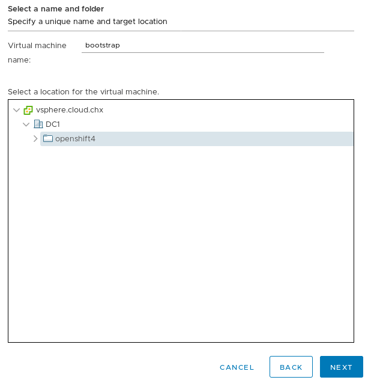
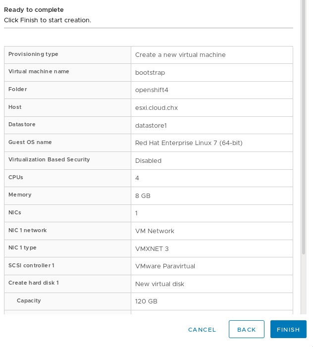

# Import OVA on vSphere

Access the vCenter web ui:
----
https://<vcenter-url>.com
User: <administrator@vsphere.local>
Password: <admin_password>
----

#### Import ISO Template

vSphere Preparations
For static IP configurations, you will need to upload the ISO into a datastore. On the vSphere WebUI, click on the “Storage” navigation button (it looks like stacked cylinders), and click on the datastore you’d like to upload the ISO to. In my example, I have a datastore specifically for ISOs:

1. In the vSphere Client, create a folder in your datacenter to store your VMs.

    a. Click the VMs and Templates view.

    b. Right-click the name of your datacenter.

    c. Click New Folder → New VM and Template Folder.

    d. In the window that is displayed, enter the folder name. The folder name must match the cluster name that you specified in the *install-config.yaml* file.

image::images/01-vcenter-create-folder.png[Creating Folder]

2. On the right hand side window, you’ll see the summary page with navigation buttons. Select “Upload Files” and select the RHCOS ISO.

NOTE: Make sure you upload the ISO to a datastore that all your ESXi hosts have access to.

Once uploaded, you should have something like this:

image::images/17.vcenter-iso.uploaded.png[ISO]

You will also need the aforementioned OpenShift 4 Metal BIOS file. I’ve downloaded the bios file and saved it as bios.raw.gz on my webserver.

---
[root@webserver ~]# ll /var/www/html/install/bios.raw.gz
-rw-r--r--. 1 root root 700157452 Oct 15 11:54 /var/www/html/install/bios.raw.gz
---

### Creating the Virtual Machines

You create the RHCOS VMs for OpenShift 4 the same way you do any other VM. I will go over the process of creating the bootstrap VM. The process is similar for the masters and workers.

On the VMs and Template navigation screen (the one that looks like sheets of paper); right click your openshift4 folder and select New Virtual Machine.

image::images/25.newvirtualmachinestatic[New Virtual Machine]

The “New Virtual Machine” wizard will start.

image::images/26.createnewvirtmachinestaticips.png[Create New Virtual Machine]

Make sure “Create a new virtual machine” is selected and click next. On the next screen, name this VM “bootstrap” and make sure it gets created in the openshift4 folder. It should look like this:

On the next screen, choose an ESXi host in your cluster for the initial creation of this bootstrap VM, and click “Next”. The next screen it will ask you which datastore to use for the installation. Choose the datastore appropriate for your installation.

image::images/28.storageconfigbootstrapstatic.png[Storage Configurate]

On the next page, it’ll ask you to set the compatibility version. Go ahead and select “ESXi 6.7 and Later” for the version and select next. On the next page, set the OS Family to “Linux” and the Version to “Red Hat Enterprise Linux 7 (64-Bit).

image::images/29.osfamily.png[OS Family]

After you click next, it will ask you to customize the hardware. For the bootstrap set 4vCPUs, 8 GB of RAM, and a 120GB Hard Drive.

image::images/30.boostrapvmsettnigs-static.png[BootStrap VM Settings]

On The “New CD/DVD Drive” select “Datastore ISO File” and select the RHCOS ISO file you’ve uploaded earlier.

Next, click on the “VM Options” tab and scroll down and expand “Advanced”. Set “Latency Sensitivity” to “High”.

Click “Next”. This will bring you to the overview page:

image::images/servers-resources.png[Servers Resources]

Go ahead and click “Finish”, to create this VM.

You will need to run through these steps at least 5 more times (3 masters and 2 workers). Use the table below (based on the official documentation) to create your other 5 VMs.

NOTE, if you’re cloning from the bootstrap, make sure you adjust the parameters accordingly and that you’re selecting “thin provision” for the disk clone.

Once you have all the servers created, the openshift4 directory should look something like this:

image::images/02-vcenter-deploy-ova.png[Deploying OVA]

Next, boot up your bootstrap VM and open up the console. You’ll get the “RHEL CoreOS Installer” install splash screen. Hit the TAB button to interrupt the boot countdown so you can pass kernel parameters for the install.

[NOTE] 
In the following steps, you use the same template for all of your cluster machines and provide the location for the Ignition config file for that machine type when you provision the VMs.

a. From the Hosts and Clusters tab, right-click your cluster’s name and click Deploy OVF Template.

image::images/02-vcenter-deploy-ova.png[Deploying OVA]

b. On the Select an OVF tab, specify the name of the RHCOS OVA file that you downloaded or Add the url to RHCOS OVA (https://mirror.openshift.com/pub/openshift-v4/dependencies/rhcos/4.3/latest/[see here]) and click on NEXT button:

image::images/03-vcenter-ova-url.png[Deploying OVA]

c. On the Select a name and folder tab, set a Virtual machine name, such as RHCOS, click the name of your vSphere cluster, and select the folder you created in the previous step.

image::images/04-vcenter-ova-folder.png[Deploying OVA]

d. On the Select a compute resource tab, click the name of your vSphere cluster.

image::images/05-vcenter-ova-compute.png[Deploying OVA]

e. On the Select storage tab, configure the storage options for your VM.

    * Select Thin Provision.

    * Select the datastore that you specified in your *install-config.yaml* file.

image::images/06-vcenter-ova-storage.png[Deploying OVA]

f. On the Select network tab, specify the network that you configured for the cluster, if available.

image::images/07-vcenter-ova-network.png[Deploying OVA]

g. If you plan to use the same template for all cluster machine types, do not specify values on the Customize template tab.

    * Don't fill anything yet (these parameters will be filled further). Click NEXT.
    
image::images/08-vcenter-ova-template.png[Deploying OVA]

    * Click em Finish in the next screen

image::images/09-vcenter-ova-finish.png[Deploying OVA]

